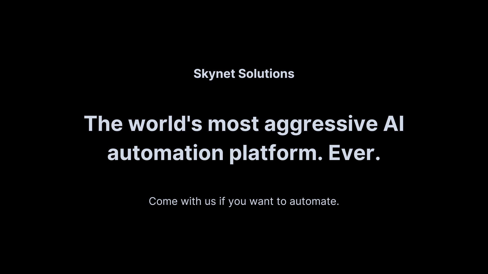

# Skynet Solutions: A Creative AI Company Mockup

## The Vision

This project started with a simple question: What if we created a company website that perfectly captures the uncanny valley between helpful AI assistance and subtle dystopian undertones? Skynet Solutions is my playful exploration of that idea, mixing professional corporate aesthetics with slightly unsettling AI promises.

## Creative Direction

The site intentionally walks a fine line between:

- Professional corporate messaging and subtle dark humor
- Helpful AI solutions and vaguely ominous implications
- Clean, modern design and unsettling interactive elements

Every element, from the pulsing red indicators to the smoothly transitioning UI components, was carefully crafted to enhance this duality.

## Technical Highlights

Built with:

- Astro for blazing-fast static site generation
- Tailwind CSS for smooth animations and responsive design
- TypeScript for type-safe components
- React for interactive elements

## The Experience

Visitors are guided through a carefully crafted journey that includes:

- A landing page that feels both welcoming and slightly off
- FAQ sections with answers that make you question whether to laugh or worry
- Interactive elements that respond in unexpectedly "helpful" ways
- Easter eggs and subtle hints that not everything is quite what it seems

## Behind the Project

This was a fun exercise in:

- Balancing humor with design
- Creating engaging user interactions
- Playing with AI-related tropes in a fresh way
- Implementing smooth animations and transitions

## Live Demo

Experience the slight discomfort yourself at [skynetsolutions.app](https://www.skynetsolutions.app/)

---

_Created by Andrew Rowley as an exploration of AI company aesthetics and dark corporate humor. No actual autonomous systems were developed in the making of this project... that you know of._
